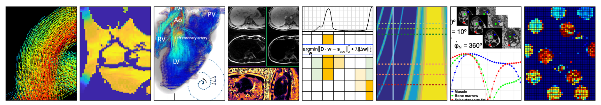

# About Us

The Quantitative MR Imaging Science Lab (QIS LAB) is headed by Prof. Jessica Bastiaansen. Our lab is affiliated to the school of Biomedical Engineering of the University of Bern and hosted by the Department of Radiology (DIPR) at the University Hospital of Bern (Inselspital).

Our lab is physically located in the Swiss Institute for Translational and Entrepreneurial Medicine and part of the Translational Imaging Center. We work in close collaboration with clinicians as well as scientists from industry.

Check [**our website**]( https://qis-mri.unibe.ch/) for more info!

<!-- https://docs.github.com/github/writing-on-github/getting-started-with-writing-and-formatting-on-github/basic-writing-and-formatting-syntax --!> 
